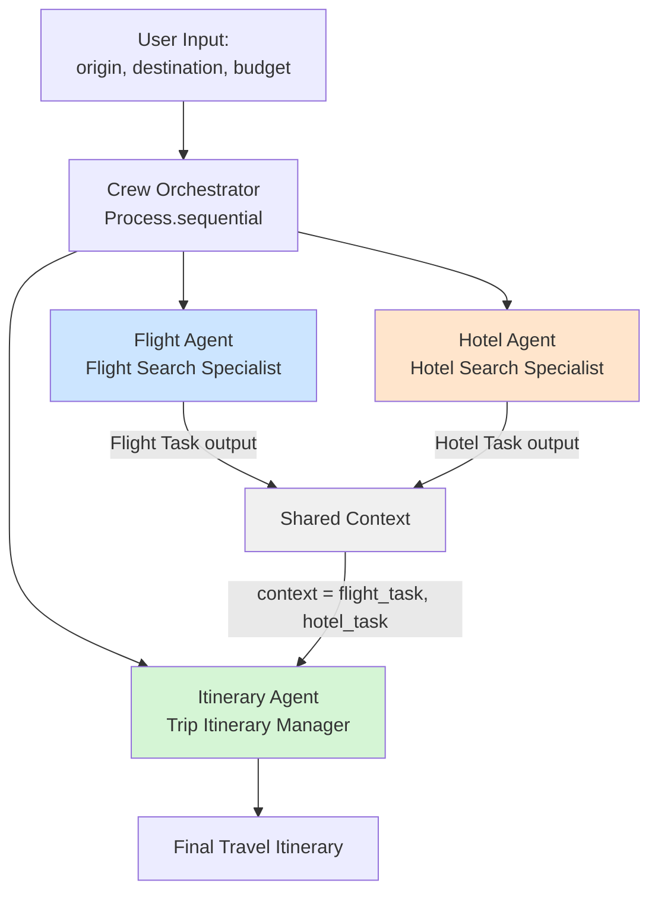

# System Architecture & Agent Dependencies

## Overview
This diagram shows the three agents in the Smart Travel Planner crew, their execution order, and how data flows between them (the "handoff protocol").

## Architecture Diagram



## Execution Order (Sequential Process)

1. **Flight Agent** runs first — searches for flight options based on origin, destination, and budget.
2. **Hotel Agent** runs second — searches for hotel options based on destination and budget (runs independently of the Flight Agent).
3. **Itinerary Agent** runs last — receives the outputs of both previous tasks as `context`, and combines them into one final itinerary that respects the total budget.

## Handoff Protocol

The dependency between agents is implemented in `main.py` using CrewAI's `context` parameter:

```python
itinerary_task.context = [flight_task, hotel_task]
```

This means the Itinerary Agent does not repeat the flight/hotel search — it receives the *already completed* outputs of the other two tasks as input, and its only job is to merge and validate them against the budget.